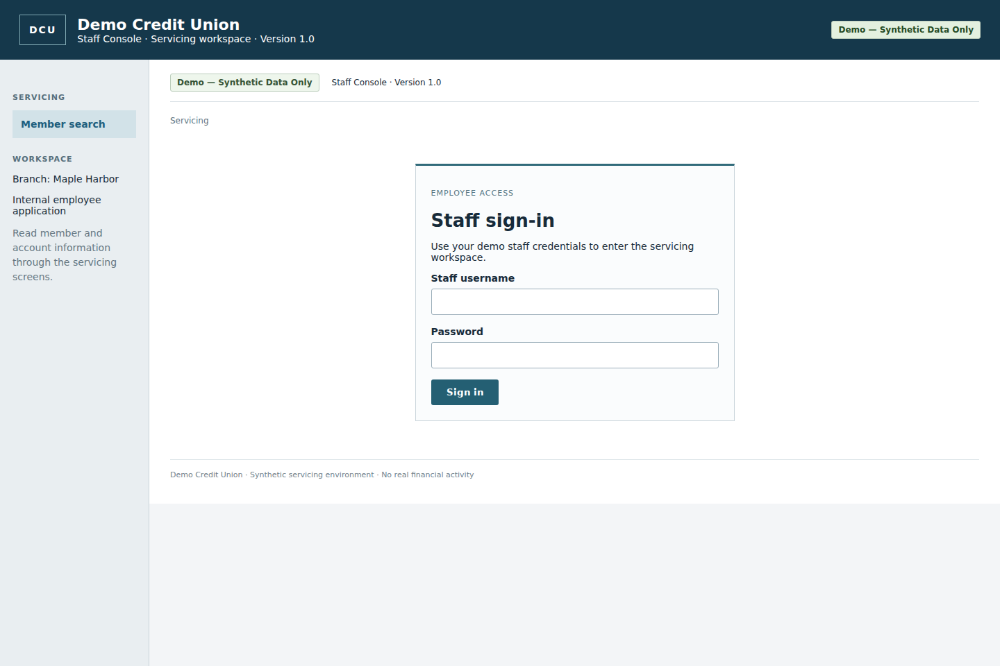

# Computer-Use Banking Automation

A runnable, single-process Python automation engine and a separate **Demo Credit Union — Staff Console**. The model discovers a workflow through visible browser controls; a typed JSON capability records explicit input bindings; replay uses that capability without model decisions.



**Demo — Synthetic Data Only.** Never connect this project to a real bank.

## Delivery status and evidence honesty

Implemented: the FastAPI/SQLite banking app, iframe surface, reproducible scenarios, typed artifacts, a configurable real-model adapter, compiler, deterministic replay, policy enforcement, sanitized evidence, and terminal-driven same-browser takeover/resume.

The checked-in evidence demonstrates **real Chromium execution with a genuine LLM discovery**, replay of its artifact with different inputs, a business outcome, a recovered read failure, and a real human takeover/resume. Simulated-provider runs remain under `evidence/offline/` and are labeled separately. A hand-authored artifact is also included solely for executor testing.

The genuine discovery, deterministic replay, and human takeover/resume records are preserved under `evidence/live-discovery/`, `evidence/live-replay/`, and `evidence/live-handoff/`. Provider token/cost metrics and raw browser traces are not recorded. Nothing has been emailed; publishing still requires explicit authorization.

See [evidence/README.md](evidence/README.md), [evidence/manifest.json](evidence/manifest.json), and [evidence/test-summary.json](evidence/test-summary.json) for what actually ran. [REPORT.md](REPORT.md) explains the design and limits.

## Install

Python 3.11+; tested with Python 3.12. Use an ordinary desktop session for human takeover.

```bash
python -m venv .venv
source .venv/bin/activate
# Windows PowerShell: .venv\Scripts\Activate.ps1
python -m pip install -r requirements.lock
python -m pip install --no-deps -e .
python -m playwright install chromium
# Linux CI missing system packages: python -m playwright install --with-deps chromium
```

`requirements.lock` pins runtime, test, and formatting dependencies. `pyproject.toml` also pins direct dependencies. The `.env.example` file is a reference only; variables are read from the process environment, not auto-loaded from that file.

## Seed and launch the bank

From the repository root:

```bash
python -m automation.cli seed
python -m automation.cli scenario normal
python -m automation.cli serve
```

Open <http://127.0.0.1:8000/>. Keep the server running in this terminal; use a second activated terminal for automation commands. `seed` intentionally resets the demo database, sessions, and audit history. Stop active runs before resetting it. Logical seed records and balances are deterministic; password salts and session tokens are securely generated.

Synthetic staff accounts:

| Username | Demo password | Role |
|---|---|---|
| `teller` | `DemoBank!2026` | Default teller; cannot access restricted accounts |
| `supervisor` | `DemoBank!2026` | Supervisor; for manual app testing |

The automation will prompt for credentials, or read them from these variables:

```bash
export BANK_STAFF_USER=teller
export BANK_STAFF_PASSWORD='DemoBank!2026'
# PowerShell: $env:BANK_STAFF_USER='teller'
# PowerShell: $env:BANK_STAFF_PASSWORD='DemoBank!2026'
```

The primary read-only run uses the teller. Permission denial stops execution; the engine never switches roles to bypass it.

## Genuine discovery and deterministic replay

Configure your own model endpoint and key. The default adapter uses the OpenAI-compatible Chat Completions API and requires JSON-schema structured output support.

```bash
export OPENAI_API_KEY='YOUR_API_KEY'
export LLM_MODEL='gpt-4o'
# Optional: export LLM_BASE_URL='https://api.openai.com/v1'
python -m automation.cli scenario normal
python -m automation.cli discover --provider openai \
  --member 10001 --product 'Primary Savings' --headed \
  --goal 'Find the member identified by input_ref member_id and return current and available balances for the active product identified by input_ref product_name.' \
  --artifact-out artifacts/read-account-balances.json
```

Success writes `artifacts/read-account-balances.json` and a provenance-linked copy under `evidence/live-discovery/<run-id>/capability.json` for the recorded live run. A model's `finish` response cannot create an artifact unless the final state and every required output validate. Invalid model responses get at most two retries; the run has a 25-step and 300-second live-run budget when invoked with `--timeout 300`.

Now replay **the same discovered artifact with a different member**, with model access disabled:

```bash
unset OPENAI_API_KEY
# PowerShell: Remove-Item Env:OPENAI_API_KEY
python -m automation.cli replay --artifact artifacts/read-account-balances.json \
  --member 10002 --product 'Primary Savings'
```

Replay never constructs a provider or imports the provider module. It returns typed JSON to the caller. Declared output values are not copied into diagnostic logs.

Synthetic expected results:

| Invocation | Current | Active holds | Available |
|---|---:|---:|---:|
| Member `10001`, Primary Savings | `4250.75` | `250.00` | `4000.75` |
| Member `10002`, Primary Savings | `9123.45` | `123.45` | `9000.00` |
| Member `10004`, Education Savings | `7000.00` | `0.00` | `7000.00` |

**Demo assumption:** available balance = current balance minus active holds. SQLite stores integer cents. Decimal parsing and decimal strings are used at the output boundary. No binary floating-point arithmetic is used for money. The displayed “As of” is the fixed synthetic ledger snapshot timestamp, not the time of the automation run.

## Offline executor and compiler demonstration

No model credentials are needed:

```bash
python -m automation.cli scenario normal
python -m automation.cli replay --artifact evidence/executor-test-capability.json \
  --member 10001 --product 'Primary Savings'

python -m automation.cli discover --provider fake \
  --member 10001 --product 'Primary Savings' \
  --artifact-out evidence/offline-capability.json
python -m automation.cli replay --artifact evidence/offline-capability.json \
  --member 10002 --product 'Primary Savings'
```

The fake provider is scripted and visibly labeled **SIMULATED**. It acts against the real browser and exercises the same compiler/executor as the real adapter. It does not count as genuine discovery. To regenerate the offline evidence bundle with the app already running:

```bash
python tools/collect_offline_evidence.py
```

This developer harness changes scenario configuration between runs. The automation packages never read that configuration or the banking database. Only the app and independent test harness do.

## Runtime scenarios

Select a scenario before a run, in the second terminal. The app reads developer configuration from `var/scenario.json`; no scenario names or control flags appear in browser observations. Setting a scenario starts a new deterministic scenario epoch; it is never randomly chosen.

```bash
python -m automation.cli scenario fail_once
python -m automation.cli replay --artifact evidence/executor-test-capability.json \
  --member 10001 --product 'Primary Savings'
python -m automation.cli scenario normal
```

| Scenario | Visible behavior and engine outcome |
|---|---|
| `normal` | Normal UI; verify and return balances |
| `member_not_found` | Missing-record message; `MEMBER_NOT_FOUND` business outcome |
| `invalid_member_id` | Validation message; `INVALID_INPUT` business outcome |
| `no_matching_active_account` | Empty account table; `NO_ELIGIBLE_ACCOUNT` business outcome |
| `permission_denied` | Staff access denied; hard failure without role switching |
| `session_expiry` | Details request expires the session once; sign-in preserves the intended account destination |
| `slow_account_loading` | Details response delayed two seconds; bounded navigation wait |
| `fail_once` | First details request shows a temporary failure and safe retry link; one recorded retry |
| `blocking_dialog` | Visible service notice; intervention required |

Without injected scenarios: member `99999` is missing, `10005` has no savings account, `10006` has only closed savings, and `10007` is restricted. Members `10002` and `10003` share a fictional display name. The human UI supports paginated name search; the automation capability uses exact member-ID lookup.

## Real human takeover / resume demonstration

Use a computer with a visible desktop and the terminal in which you start the run. After genuine discovery, use its artifact; the executor-test artifact can be used to practice the mechanism.

```bash
python -m automation.cli scenario session_expiry
python -m automation.cli replay --artifact artifacts/read-account-balances.json \
  --member 10001 --product 'Primary Savings' \
  --headed --interactive --timeout 600
```

1. Automation reaches account details, encounters the expired session, and stops dispatching actions.
2. The same terminal prints the intervention/run ID. Type `claim`.
3. In the **existing browser window**, sign in with the demo teller credentials. Do not open a new window or restart the app. The bank rotates its authentication cookie normally but the browser process, context, and page are preserved.
4. The bank returns you to the intended account details. Verify the member and product, then type `resume` in the original terminal.
5. The engine checks origin, compatibility, member, product, status, currency, balances, and timestamp. It rejects an early or incorrect resume while leaving ownership with the human. Once verified, it finishes without repeating the account-opening step.

Type `abort` to end an intervention. The operator budget is five minutes; `--timeout` caps the whole run including browser startup and human time. A headless/noninteractive run returns `intervention_required` and closes the browser; it does not claim to preserve a remotely resumable session.

Human events record event category, element tag, frame category, and ownership transitions. Values, keystrokes, URLs, cookies, screenshots, and raw DOM are not recorded. Hooks cover document clicks/inputs/changes/submits and navigations in the instrumented page and its frames. They do not observe browser chrome, OS dialogs, or every semantic action. After an unknown mid-workflow state, the supported resume checkpoint is the fully verified requested account. Arbitrary intermediate resume/merging human actions into a reusable capability is deliberately unsupported.

## Tests

```bash
python -m pytest -q
# Same real tests plus a sanitized evidence summary:
python tools/verify.py
python -m ruff check automation banking_app tests tools --select F
```

Tests launch a separate FastAPI server on an ephemeral local port with a private temporary database. They cover schemas, binding, member/product selection, balances, business outcomes, timeouts, retry bounds, ambiguous rows/controls, forbidden requests and redirects, popups, redaction, ownership, resume verification, simulated compiler execution, and replay without model credentials. Test operator actions are explicitly simulated; they are not human evidence. The delivered verification summary records 72 passing tests with no skips.

## Layout and configuration

- `banking_app/`: private database, seed data, authentication, server-rendered screens and scenarios.
- `automation/models.py`: contracts for inputs, actions, targets, capabilities and results.
- `automation/surface.py`: visible DOM perception, scoped iframe targeting, browser actions and output checks.
- `automation/policy.py`: trusted origin/route/action policy and read-only action classification.
- `automation/provider.py`, `discovery.py`, `compiler.py`: structured model decisions and verified compilation.
- `automation/runner.py`: model-free replay and shared bounded recovery.
- `automation/handoff.py`: terminal ownership and verified same-session handback.
- `automation/evidence.py`: allowlisted events and sanitized structured failure snapshots.
- `config/`: separate versioned tenant binding and trusted policy.
- `tests/`, `tools/`: independent verification and explicitly labeled offline evidence harness.

`BANK_DB` and `BANK_SCENARIO_FILE` configure only the app/setup harness. `BANK_SESSION_SECONDS` configures server-side expiry. `--tenant` and `--policy` select automation JSON configuration. Changing the origin requires changing both files explicitly. Tenant bindings cannot alter the capability or remove policy checks. Only this vendor UI and one tenant are implemented; approved selector overrides and desktop adapters are design extensions, not implemented features.

## Safety and public-submission checklist

The primary capability cannot transfer money or modify bank accounts. The engine checks actual form/link destinations against trusted route metadata; credentials can only be filled into the correct sign-in fields. Context-wide request interception plus a Chromium response gate check destinations before redirects are followed. Popups, downloads and WebSockets are blocked; service workers are disabled. These controls continue during human ownership and resume. The read-only policy is defense in depth for this chosen sandbox, not a general-purpose security boundary for arbitrary hostile browsers or users editing trusted Python/configuration.

Evidence uses structured sanitized snapshots instead of screenshots or raw traces. Banking storage legitimately contains synthetic business records; automation diagnostics do not. `.gitignore` excludes environment files, local databases, browser/session state and local run evidence. Explicitly review and copy the sanitized genuine run folders into `evidence/` before public submission. The provided assignment PDF was read during development but is not redistributed here.

The app is bound to loopback. Its demo HTTP cookie has `HttpOnly` and `SameSite=Strict`; HTTPS plus `Secure` cookies, production identity management, operational hardening and a security review would be required for any real deployment. Do not publish the demo service as real banking software.

Reference documentation: [Playwright browser contexts](https://playwright.dev/python/docs/api/class-browsercontext), [Chromium Fetch interception](https://chromedevtools.github.io/devtools-protocol/tot/Fetch/), and [OpenAI structured outputs](https://platform.openai.com/docs/guides/structured-outputs).
